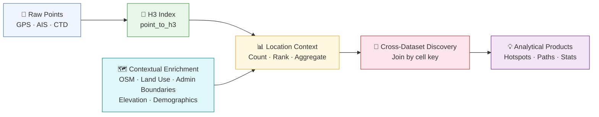

# h3tools


A Python library of utility functions for working with the [Uber H3](https://h3geo.org/docs) hierarchical hexagonal grid system.

Fully compatible with both **h3-py v3.x** and **v4.x**, and designed to integrate smoothly with `shapely`, `matplotlib`, and `pandas`.

---

## Why h3tools?

### The Problem with Points

Most geospatial data arrives as isolated dots on a map — a GPS ping, a device location, a vessel track, a crime incident, or a customer visit.

A point tells you *where* something happened.
But it tells you almost nothing about *why* it happened there.

Analysts are left staring at clusters of dots, mentally grouping them, drawing subjective conclusions, and producing insights that are difficult to quantify, reproduce, or defend. The data remains visual noise while real analytic insight stays trapped in an analyst's head, or worse, undiscovered.

> ## Stop looking at dots.

### From Coordinates to Locations

**`h3tools`** was built to break this cycle.

By assigning every point to an H3 hexagonal cell, raw coordinates are transformed into **consistent, comparable geographic units** — true *locations* that can be counted, ranked, aggregated, joined with other datasets, and analysed over time.

Once a dataset lives on the grid, there is a fundamental shift in the questions an analyst can ask:

> **"WHERE is this activity happening?"** becomes **"WHY is this activity happening at this location?"**

This shift enables aggregated statistical analysis, long-term pattern-of-life studies, and advanced temporal analytics at scale.



### The Technical Case for Geospatial Indexing

Converting coordinates to cell indices is not a cosmetic change — it fundamentally transforms the class of problem you are solving.

**Spatial queries become lookups.**
A traditional point-in-polygon check requires floating-point intersection tests against every vertex of every polygon. At scale — a million points against a thousand polygons — that is an O(n²) problem. Geospatial indexing converts a coordinate to a single integer or string at ingest. After that, "are these two points in the same area?" is a string comparison. Spatial joins become primary key lookups: **O(1)**.

**Aggregation is free.**
H3 cells are hierarchical — every cell has exactly one parent at the next coarser resolution and seven children at the next finer one. Aggregating from city block to neighbourhood to city does not require re-running a spatial join. It is a bit-shift on the cell ID. Query the data once at the finest resolution you need; every coarser resolution is already embedded in the index.

**Coordinates belong to exactly one cell.**
Traditional methods suffer from floating-point boundary effects: a point sitting on the edge between two polygons may fail to register in either, or flicker between them depending on rounding. Discrete global grids eliminate this — a coordinate maps to exactly one cell at a given resolution, deterministically, every time. Joins across datasets indexed independently are reliable.

**Every H3 neighbour is equidistant.**
Square grids have two kinds of neighbours: edge-adjacent (closer) and corner-adjacent (further). This directional bias distorts any analysis that relies on spatial proximity — radial expansion, movement modelling, diffusion. In a hexagonal grid, all six neighbours share an edge and sit at the same distance from the centre. There is no bias to correct for.

**Complex geometries become set operations.**
Checking whether a point falls inside a jagged coastline with ten thousand vertices is an expensive computation run once per point. Index the coastline as a set of H3 cells and the same check becomes a set membership test — **O(1)** per point, regardless of polygon complexity.

| | Traditional (R-Tree / Geometry) | H3 Geospatial Index |
|---|---|---|
| Data type | Floating-point coordinates | Integer / string cell IDs |
| Spatial join | O(n log n) – O(n²) | O(1) lookup |
| Aggregation | Re-run spatial join at each scale | Bit-shift on the cell ID |
| Boundary handling | Floating-point edge cases | Deterministic — one cell per coordinate |
| Neighbour uniformity | Biased (edge ≠ corner distance) | Uniform — all six neighbours equidistant |
| Polygon query | Point-in-polygon per vertex | Set membership test |
| Best fit | Precision mapping · CAD · engineering | Big data · analytics · ML · logistics |

---

### Why H3? A Deliberate Choice

The table above describes geospatial indexing in general. The choice of H3 specifically comes down to what matters most for analytical work.

We evaluated the major systems — Administrative Boundaries, Square Grids, Geohash, S2, and H3 — and H3 is the only one that delivers all three of these properties together:

- **Exceptional area uniformity** — cells at the same resolution are nearly identical in size, so comparing event counts across cells is statistically fair. Geohash cells vary significantly in area depending on latitude.
- **True hexagonal topology** — the equidistant-neighbour property described above. Square grids and Geohash do not have it; S2 uses quad-trees that share the same corner-bias problem as squares.
- **Clean hierarchical nesting** — each cell has exactly 7 children at the next finer resolution, enabling consistent multi-scale analysis. Administrative boundaries are irregular and change over time.

H3 is not without trade-offs — there is minor area distortion near the poles, and 12 pentagonal cells exist per resolution that require special handling in path operations. `h3tools` manages both transparently.

### Data Discovery at Scale

The most powerful consequence of a shared grid index is what it does to data discovery. When two independent datasets are both indexed to H3, finding spatially coincident activity becomes a cell lookup rather than a complex spatial join.

Consider dark fleet fishing operations. AIS data — the automatic position broadcasts transmitted by commercial vessels — shows a vessel that has gone dark: it stopped broadcasting in a known fishing ground, a common tactic used to conceal illegal catch. Independently, Commercial Telecommunications Data (CTD) captures millions of mobile device pings across the same area and time window. Indexed to the same H3 grid, an analyst can identify which devices were present in the same cells where the vessel went dark — potentially surfacing crew, shore contacts, or support vessels — without writing a single spatial query. Stepping up to a parent cell broadens the search area to find correlated activity across a wider region. Stepping down to child cells isolates a specific anchorage or transfer point. The relationship between the datasets is not something the analyst has to go looking for. It surfaces through the grid.

### What You Gain

With **`h3tools`**, analysts and data scientists can:

- Move from visual inspection to rigorous, reproducible spatial analysis
- Discover hidden patterns and anomalies faster
- Combine multiple datasets through simple cell-based joins
- Track how behaviours evolve across space and time
- Ask *why* questions instead of just *where* questions

---

## Choosing a resolution

H3 cells nest cleanly — each cell has exactly 7 children at the next finer resolution. Pick the resolution that matches the granularity of the activity you are analysing.

| Resolution | Avg cell area | Avg edge length | Comparable to |
|:---:|---:|---:|---|
| 5 | 252.9 km² | 9.85 km | Large metropolitan region |
| 6 | 36.1 km² | 3.72 km | City or large town |
| 7 | 5.16 km² | 1.41 km | City district / neighbourhood |
| 8 | 0.74 km² | 0.53 km | Large city block / campus |
| 9 | 0.105 km² | 0.20 km | City block |
| 10 | 0.015 km² | 0.076 km | Building footprint |
| 11 | 0.002 km² | 0.029 km | Individual room / berth |

> **Note:** Resolution 11 is useful when data is spatially noisy and a finer cell helps separate activity that would otherwise blur together at resolution 10.

---

## Before and after

Without h3tools, spatially joining two datasets requires a GIS tool or a complex query. With h3tools, it is a shared dictionary key.

```python
# Without h3tools — spatial join in raw shapely
from shapely.geometry import Point
from shapely.strtree import STRtree

ais_points   = [Point(lon, lat) for lon, lat in ais_coords]
ctd_points   = [Point(lon, lat) for lon, lat in ctd_coords]
tree         = STRtree(ctd_points)
coincident   = [ctd_points[i] for p in ais_points
                for i in tree.query(p.buffer(0.01))]
```

```python
# With h3tools — index both datasets to H3, join by cell key
from h3tools import add_h3_column

ais_df = add_h3_column(ais_df, geometry_col="geometry", resolution=9)
ctd_df = add_h3_column(ctd_df, geometry_col="geometry", resolution=9)

coincident = ais_df.merge(ctd_df, on="h3_index")
```

---

## Modules

| Module | Contents |
|---|---|
| `h3tools.core` | Cell validity, pentagon detection, resolution, area, edge length, cluster area |
| `h3tools.geo` | Point / Polygon / LineString ↔ H3; DMS, DDM, MGRS, (lat, lon) parsing; GeoJSON I/O; bounding box |
| `h3tools.analytics` | Hierarchy (parent/children/siblings), neighbours, paths, distance, hotspots, stats |
| `h3tools.viz` | Matplotlib cell plotting, heatmaps, axis formatting, choropleth |
| `h3tools.temporal` | Solar/lunar events, timezone lookup, datetime helpers |
| `h3tools.dataframe` | Pandas DataFrame integration; H3 column, counts, stats, GeoDataFrame, time-series |

---

## Installation

```bash
pip install h3tools                 # once published to PyPI
pip install -e .                    # development install (editable)
```

**Dependencies:** `h3 >= 3.7`, `shapely >= 2.0`, `numpy >= 1.24`, `pandas >= 2.0`,
`matplotlib >= 3.7`, `mgrs >= 1.4`, `astral >= 3.2`, `timezonefinder >= 8.2`,
`python-dateutil >= 2.8`

**Optional:** `ephem >= 4.1` for lunar rise/set times (`pip install h3tools[lunar]`)

---

## Quick start

```python
from shapely.geometry import Point
from h3tools import point_to_h3, h3_to_polygon, h3_to_mgrs, get_h3_neighbors

# London, Trafalgar Square
pt   = Point(-0.1278, 51.5074)
cell = point_to_h3(pt, h3_resolution=9)
print(cell)    # '89195da49b7ffff'

poly = h3_to_polygon(cell)
mgrs = h3_to_mgrs(cell)
ring = get_h3_neighbors(cell, k=2)
```

---

## Examples

### Geometry indexing

#### Point → H3

```python
from shapely.geometry import Point
from h3tools import point_to_h3, h3_to_dms, h3_to_mgrs

pt   = Point(-0.1278, 51.5074)          # London, Trafalgar Square
cell = point_to_h3(pt, h3_resolution=9)

print(cell)             # '89195da49b7ffff'
print(h3_to_dms(cell))  # ('51°30\'26.42"N', '0°07\'40.04"W')
print(h3_to_mgrs(cell)) # '30UXC0529398803'
```

#### Polygon → H3 fill

```python
from shapely.geometry import Polygon
from h3tools import polygon_to_h3

area  = Polygon([(-0.14, 51.49), (-0.11, 51.49),
                 (-0.11, 51.52), (-0.14, 51.52),
                 (-0.14, 51.49)])

cells = polygon_to_h3(area, h3_resolution=10, contain_mode='center')
print(f"{len(cells)} cells cover the polygon")
```

#### LineString → H3 cells

Linear features — roads, railways, pipelines, coastlines — can be indexed to H3
just like polygons. Every cell the line passes through is returned, making it
straightforward to find other activity that is spatially coincident with the
feature.

```python
from shapely import from_wkt
from h3tools import linestring_to_h3, cells_to_geojson

# OSM Railway Rail feature, Iran (Baghdad–Tehran line)
railway = from_wkt(
    "LINESTRING (44.2620484 33.4482356, 44.268821 33.4375409, "
    "44.2691575 33.4370196, 44.2693425 33.4367572, 44.2695535 33.4364703, "
    "44.2697312 33.4362445, 44.2699506 33.4359849, 44.2701782 33.4357353, "
    "44.2703954 33.435516,  44.2706062 33.4353171, 44.270817 33.4351232,  "
    "44.2719754 33.4340614, 44.278463  33.4281725, 44.2795485 33.4271947, "
    "44.2827744 33.4242586, 44.2880769 33.4194545, 44.2883685 33.4191889, "
    "44.288611  33.4189595, 44.2887982 33.4187707, 44.2890119 33.4185441, "
    "44.2891987 33.4183381, 44.289389  33.4181024, 44.2895267 33.4179221, "
    "44.289673  33.4177244, 44.2898215 33.4175097, 44.2929522 33.4129993, "
    "44.2982919 33.4053253, 44.3026148 33.3991009)"
)

cells = linestring_to_h3(railway, resolution=9)
print(f"{len(cells)} H3 cells cover the railway segment")  # 22 cells

# Export to GeoJSON for display in any mapping tool
geojson = cells_to_geojson(cells)
```

#### Coordinate formats

```python
from h3tools import geometry_to_h3

# All of these return a set of H3 cells at resolution 9:
geometry_to_h3((51.5074, -0.1278), 9)              # lat/lon tuple
geometry_to_h3("51°30'26\" N 0°07'40\" W", 9)      # DMS pair
geometry_to_h3("51 30.4 N 0 7.7 W", 9)             # DDM pair
geometry_to_h3("30UXC0529398803", 9)                # MGRS
geometry_to_h3("89195da49b7ffff", 9)                # H3 index
```

---

### GeoJSON I/O

```python
from h3tools import cells_to_geojson, geojson_to_cells
import json

# Cells → GeoJSON FeatureCollection
geojson = cells_to_geojson(cells)
print(json.dumps(geojson, indent=2))

# GeoJSON → cells (accepts dict or JSON string)
recovered = geojson_to_cells(geojson, resolution=10)
```

### Bounding box

Convert any Shapely geometry (Polygon, MultiPolygon, LineString, …) to a
PostGIS-compatible `BOX` string, or get the envelope as a Shapely Polygon.
Point geometries are rejected — a single point has coincident bounds and
cannot form a meaningful bounding box.

```python
from shapely.geometry import Polygon
from h3tools import geometry_to_box

poly = Polygon([(-0.14, 51.49), (-0.11, 51.49),
                (-0.11, 51.52), (-0.14, 51.52)])

# PostGIS BOX string (default)
box_str = geometry_to_box(poly)
print(box_str)   # BOX(-0.14 51.49,-0.11 51.52)

# Shapely Polygon envelope
envelope = geometry_to_box(poly, as_polygon=True)
```

---

### Pandas integration

```python
import pandas as pd
from h3tools import add_h3_column, h3_count, h3_stats_df

# Add an H3 column from a Shapely Point geometry column
df = add_h3_column(df, geometry_col="geometry", resolution=9)

# Count events per cell (returns a Series, most frequent first)
counts = h3_count(df)

# Summary statistics as a single-row DataFrame
stats = h3_stats_df(counts)   # accepts Series directly
print(stats[["total_events", "unique_cells", "mean", "p95"]])
```

### GeoDataFrame choropleth

Convert a cell-count distribution to a GeoPandas GeoDataFrame and render a
publication-ready choropleth in two lines.  The GeoDataFrame is also
compatible with QGIS, Folium, and any tool that accepts GeoPandas input.

```python
import matplotlib.pyplot as plt
from h3tools import add_h3_column, h3_count, plot_h3_choropleth

df     = add_h3_column(df, geometry_col="geometry", resolution=9)
counts = dict(h3_count(df))   # {cell: count, ...}

fig, ax = plt.subplots(figsize=(10, 8))
plot_h3_choropleth(ax, counts, title="Event density by H3 cell (resolution 9)")
plt.tight_layout()
plt.show()
```

Or build the GeoDataFrame directly for further processing:

```python
from h3tools import h3_to_geodataframe

gdf = h3_to_geodataframe(counts.keys(), cell_counts=counts)
# gdf has columns: h3_index, geometry (Polygon), count
gdf.to_file("events.gpkg", driver="GPKG")   # export to GeoPackage
```

---

### Time-series aggregation

Aggregate event counts by H3 cell and time period for pattern-of-life
analysis, trend detection, or animated choropleth workflows.

```python
import pandas as pd
from h3tools import add_h3_column, h3_timeseries

df = add_h3_column(df, geometry_col="geometry", resolution=9)

# Daily event counts per cell — long format (h3_index, period, value)
ts = h3_timeseries(df, freq="D")

# Hourly — useful for AIS / CTD data
ts_hourly = h3_timeseries(df, freq="h")

# Aggregate a value column instead of counting rows
ts_sum = h3_timeseries(df, value_col="signal_strength", agg="mean", freq="W")

# Pivot to wide format — periods as rows, cells as columns
wide = ts.pivot(index="period", columns="h3_index", values="value")
```

---

### Analytics

```python
from h3tools import (
    get_h3_path, get_h3_distance,
    find_h3_hotspots, get_h3_stats,
    get_h3_delta,
)
from collections import Counter

# Grid path between two cells (pentagon-safe)
path = get_h3_path("89195da49b7ffff", "89195da498fffff")

# Distance in km
km = get_h3_distance("89195da49b7ffff", "89195da498fffff", unit="km")

# Hotspot detection
event_counts = Counter(df["h3_index"])
hotspots = find_h3_hotspots(event_counts, threshold=1.5, method="zscore")

# Descriptive statistics
stats = get_h3_stats(event_counts)
print(stats["top_cells"])      # top 5 cells by count

# Compare two snapshots
delta = get_h3_delta(yesterday_counts, today_counts)
print(delta["gained"], delta["lost"], delta["net_change"])
```

---

### Visualisation

```python
import matplotlib.pyplot as plt
from h3tools import plot_hex, plot_hex_heatmap, format_plot

fig, axes = plt.subplots(1, 2, figsize=(14, 6))

# Solid fill
plot_hex(axes[0], list(cells), {'Facecolor': 'steelblue', 'Alpha': 0.6})
format_plot(axes[0])

# Heatmap
values = {c: event_counts.get(c, 0) for c in cells}
norm = plot_hex_heatmap(axes[1], values, cmap='plasma')
plt.colorbar(plt.cm.ScalarMappable(cmap='plasma', norm=norm), ax=axes[1])

plt.tight_layout()
plt.show()
```

---

### Solar and temporal

```python
from shapely.geometry import Point
from h3tools import get_solar_data, get_lunar_data, point_to_tz_offset
from datetime import datetime

pt   = Point(-0.1278, 51.5074)
date = datetime(2026, 4, 24)

solar = get_solar_data(pt, date)
print(solar['Sunrise'].strftime('%H:%M %Z'))    # 05:51 BST
print(solar['Sunset'].strftime('%H:%M %Z'))     # 20:18 BST
print(solar['Solar Noon'].strftime('%H:%M %Z')) # 13:04 BST
print(f"{solar['Day Length (Hours)']:.2f} hrs") # 14.45 hrs

# Optional: observer elevation (metres); skip twilight for speed
solar = get_solar_data(pt, date, elevation=50.0, include_twilight=False)

lunar = get_lunar_data(pt, date)
print(lunar['Phase Name'])                      # e.g. 'Waxing Gibbous'
print(f"{lunar['Illumination (%)']:.1f}%")
print(f"Moon age: {lunar['Moon Age (Days)']} days")
print(f"Waxing: {lunar['Is Waxing']}")

tz_name, utc_offset = point_to_tz_offset(pt, date)
print(tz_name, utc_offset)                      # Europe/London  1.0
```

---

## In-library reference

```python
import h3tools

# Concise function catalogue — name and one-line description, grouped by module
h3tools.list_functions()

# Full quick-reference — signatures, parameters, and descriptions
help(h3tools)
```

Both work offline. `list_functions()` is the faster way to find what you need;
`help()` gives the full parameter documentation for every function.

---

## Running tests

```bash
pip install -e ".[dev]"
pytest                  # 327 tests
```

---

## Project structure

```
h3tools/
├── h3tools/
│   ├── __init__.py       # Public API surface + help() quick reference
│   ├── _validators.py    # Internal validation helpers
│   ├── core.py           # H3 version shim + basic cell properties
│   ├── geo.py            # Geometry ↔ H3 conversions; GeoJSON I/O
│   ├── analytics.py      # Hierarchy, neighbours, paths, distance, stats
│   ├── viz.py            # Matplotlib plotting helpers
│   ├── temporal.py       # Solar/lunar data, timezone, datetime helpers
│   └── dataframe.py      # Pandas DataFrame integration
├── tests/
│   └── test_h3tools.py
├── pyproject.toml
├── CHANGELOG.md
└── README.md
```

---

## Compatibility

| h3-py | Python | Status |
|-------|--------|--------|
| 3.7 – 3.8 | 3.9+ | ✅ tested |
| 4.0 – 4.x | 3.9+ | ✅ tested |

---

## Licence

MIT
